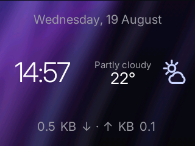
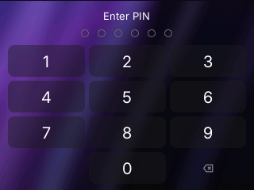
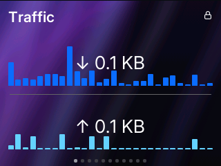
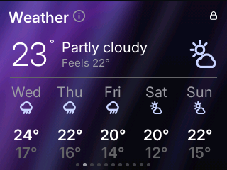
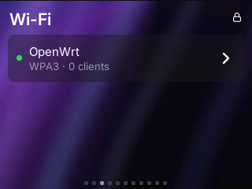
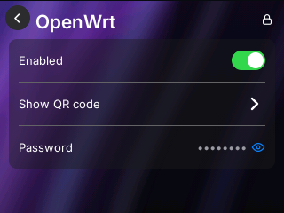
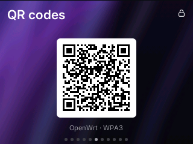
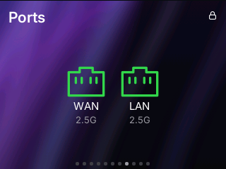
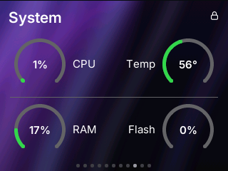

# glinet-panel-ui

The front panel interface for the GL.iNet BE10000 and BE14000: a 320x240 DRM
display with a capacitive touchscreen, driven from ucode.

It shows an idle clock with the weather and the link rate, then a set of pages
the user swipes between: traffic, wireless, the networks and their switches, the
radios, QR codes to join them, the clients, the interfaces and their addresses,
the ports, the system gauges, brightness and reboot. Rows open sub pages with
the detail behind them.

Written against [ucode-mod-lvgl](https://github.com/blogic/ucode-mod-lvgl).

## Screens

Every picture below is the panel itself at 320x240, taken with
ubus call lvgl screenshot.

<table>
<tr>
<td align="center"> Idle</td>
<td align="center"> PIN</td>
<td align="center"> Traffic</td>
</tr>
<tr>
<td align="center"> Weather</td>
<td align="center"> Wi-Fi</td>
<td align="center"> Wi-Fi, one network</td>
</tr>
<tr>
<td align="center"> QR codes</td>
<td align="center"> Ports</td>
<td align="center"> System</td>
</tr>
</table>

## Packaging

The OpenWrt package is glinet-panel-ui in
[feed-blogic](https://github.com/blogic/feed-blogic).

## Licence

The application is GPL-2.0-only; LICENSE.txt carries the text.
